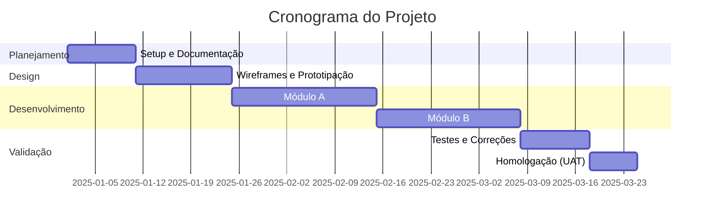

# 05 - Cronograma de Entregas

**Documentos de Origem:** [02 - Especificação do Projeto](02-Especificacao-do-Projeto.md) | [04 - Metodologia](04-Metodologia.md)

Este documento define o planejamento temporal do projeto, estabelecendo as fases de desenvolvimento, os marcos de entrega e os mecanismos de controle de prazo. A estrutura é fundamentada nas práticas do **PMBOK® (Project Management Body of Knowledge)**, com ênfase em estimativas realistas, reservas de tempo e tratamento proativo de riscos de atraso.

---

## 1. Fases e Marcos do Projeto

O projeto é dividido em fases sequenciais, cada qual com entregas objetivas e critérios de conclusão mensuráveis. A conclusão de cada fase é formalmente registrada via **GitHub Issue** ou documento de aceite.

| # | Fase | Entregas Principais | Data de Início | Data de Término | Marco de Aceite |
| :--- | :--- | :--- | :--- | :--- | :--- |
| **F1** | Planejamento e Setup | Docs 01–04.5 assinados, repositório configurado, arquitetura base definida. | DD/MM/AAAA | DD/MM/AAAA | Assinatura do Doc 03 e 04.5 |
| **F2** | Design e Prototipação | Wireframes e fluxos de usuário validados (Doc 05). | DD/MM/AAAA | DD/MM/AAAA | Aceite de Interface (Doc 05) |
| **F3** | Desenvolvimento — Módulo [A] | [Funcionalidade / RF principal do módulo A] funcional em ambiente de testes. | DD/MM/AAAA | DD/MM/AAAA | Demonstração aprovada via Issue |
| **F4** | Desenvolvimento — Módulo [B] | [Funcionalidade / RF principal do módulo B] funcional em ambiente de testes. | DD/MM/AAAA | DD/MM/AAAA | Demonstração aprovada via Issue |
| **F5** | Testes e Correções | Suíte de testes executada (Docs 08–11), falhas críticas corrigidas. | DD/MM/AAAA | DD/MM/AAAA | Relatórios de teste finalizados |
| **F6** | Homologação (UAT) | Sistema implantado em ambiente de produção para validação final do cliente. | DD/MM/AAAA | DD/MM/AAAA | Assinatura do Doc 12 |

> **Instrução:** Divida os módulos de desenvolvimento (F3, F4...) conforme a quantidade real de grandes blocos funcionais identificados na Especificação. Cada módulo deve representar um conjunto coeso de Requisitos Funcionais que possam ser entregues e demonstrados de forma independente.

---

## 2. Estimativas e Reserva de Contingência (PMBOK)

### 2.1. Conceito
O PMBOK estabelece que estimativas de prazo devem contemplar, além do esforço produtivo, uma **Reserva de Contingência** — tempo adicional calculado para absorver riscos identificados — e uma **Reserva Gerencial** — buffer destinado a eventos imprevisíveis que não puderam ser mapeados na fase de planejamento.

```
Duração Total do Projeto =
    Σ Duração Estimada das Fases
  + Reserva de Contingência  (riscos conhecidos)
  + Reserva Gerencial        (riscos desconhecidos)
```

### 2.2. Tabela de Estimativas por Fase

| Fase | Duração Estimada (dias úteis) | Reserva de Contingência | Duração com Reserva |
| :--- | :--- | :--- | :--- |
| F1 — Planejamento e Setup | [X] dias | [+Y dias / +Z%] | [Total] dias |
| F2 — Design e Prototipação | [X] dias | [+Y dias / +Z%] | [Total] dias |
| F3 — Desenvolvimento Módulo [A] | [X] dias | [+Y dias / +Z%] | [Total] dias |
| F4 — Desenvolvimento Módulo [B] | [X] dias | [+Y dias / +Z%] | [Total] dias |
| F5 — Testes e Correções | [X] dias | [+Y dias / +Z%] | [Total] dias |
| F6 — Homologação (UAT) | [X] dias | [+Y dias / +Z%] | [Total] dias |
| **Reserva Gerencial (nível projeto)** | — | **[X% do total]** | [Total] dias |
| **PRAZO TOTAL DO PROJETO** | | | **[Total Final] dias úteis** |

> **Referência PMBOK:** A Reserva de Contingência é aplicada fase a fase e gerenciada pelo desenvolvedor. A Reserva Gerencial é controlada em nível de projeto e acionada apenas para eventos imprevisíveis de alto impacto, mediante comunicação formal. Valores típicos: 10–20% por fase para contingência; 5–10% do total do projeto para reserva gerencial.

---

## 3. Ferramentas de Monitoramento e Visualização

### 3.1. Visualização do Cronograma

| Ferramenta | Tipo | Custo | Indicada Para |
| :--- | :--- | :--- | :--- |
| **GitHub Projects** | Kanban + Roadmap | Gratuito | Projetos já hospedados no GitHub |
| **ClickUp** | Gantt + Kanban + Timeline | Gratuito (plano básico) | Projetos com múltiplos módulos e clientes |
| **Notion** | Timeline + Banco de dados | Gratuito (plano básico) | Equipes que centralizam documentação |
| **ProjectLibre** | Gantt + Caminho Crítico | Gratuito (open source) | Equivalente ao MS Project sem custo |
| **GanttProject** | Gantt clássico | Gratuito | Projetos simples com poucas fases |
| **Mermaid.js** | Gantt em Markdown | Gratuito | Visualização direto no GitHub / Notion |

**Exemplo de Gantt em Mermaid.js (para uso em Markdown):**


### 3.2. Métricas de Desempenho do Cronograma (EVM — Earned Value Management)

O **Gerenciamento de Valor Agregado (EVM)** permite medir objetivamente se o projeto está adiantado, atrasado ou dentro do prazo, com base em dados quantitativos.

| Indicador | Fórmula | Interpretação |
| :--- | :--- | :--- |
| **SV** — Variação de Prazo *(Schedule Variance)* | `SV = VA – VP` | SV > 0: adiantado \| SV < 0: atrasado \| SV = 0: no prazo |
| **SPI** — Índice de Desempenho de Prazo *(Schedule Performance Index)* | `SPI = VA / VP` | SPI > 1: adiantado \| SPI < 1: atrasado \| SPI = 1: no prazo |

> **Legenda:** VA = Valor Agregado (trabalho efetivamente concluído em $); VP = Valor Planejado (trabalho que deveria estar concluído em $).

**Ferramentas com suporte a EVM:**
- Planilha Google Sheets / Excel com template EVM (gratuito, alta personalização)
- **nTask** — EVM integrado com Gantt
- **ProjectManager.com** — EVM e relatórios automáticos
- **MS Project** — EVM nativo (licença paga)

---

## 4. Tratamento de Riscos de Atraso

### 4.1. Registro de Riscos de Cronograma

Os riscos abaixo foram identificados na fase de planejamento e já estão incorporados na Reserva de Contingência da fase correspondente.

| ID | Risco | Fase Impactada | Probabilidade | Impacto | Resposta |
| :--- | :--- | :--- | :--- | :--- | :--- |
| **R-01** | Atraso na aprovação de wireframes pelo cliente | F2 | Média | Alto | Contingência de [X] dias na F2. Prazo máximo de resposta: 5 dias úteis após envio. |
| **R-02** | Escopo de requisito subestimado durante desenvolvimento | F3 / F4 | Média | Alto | Contingência de [X] dias por módulo. Se exceder, aciona Change Request. |
| **R-03** | Indisponibilidade de ambiente de produção na entrega | F6 | Baixa | Alto | Contingência de [X] dias na F6. Responsabilidade de provisionar o ambiente deve ser acordada previamente. |
| **R-04** | Feedback de homologação exige correções de alto volume | F6 | Média | Médio | Contingência de [X] dias na F6. Correções além da garantia estão sujeitas a novo orçamento. |
| **R-05** | Dependência de terceiros (API externa, fornecedor, cliente) | Qualquer | Variável | Alto | Mapeamento prévio das dependências externas no início de cada fase. Atrasos por terceiros não imputáveis ao desenvolvedor são formalizados como extensão de prazo sem penalidade. |

> **Instrução:** Adicione os riscos específicos identificados durante o levantamento do projeto. Cada risco deve ter sua contingência já embutida na estimativa da fase correspondente.

### 4.2. Estratégias de Compressão de Cronograma (PMBOK)
Caso uma fase extrapole a reserva de contingência, as seguintes estratégias podem ser aplicadas, em ordem de preferência:

1. **Fast-tracking:** Paralelizar atividades que originalmente seriam sequenciais, aceitando maior sobreposição de risco técnico.
2. **Crashing:** Aumentar recursos alocados na fase crítica (horas adicionais de desenvolvimento), com possível impacto no custo total — sujeito a negociação com o contratante.
3. **Redução de Escopo (Descoping):** Em último caso, mover Requisitos de prioridade MÉDIA ou BAIXA para uma fase posterior ou novo contrato, preservando a data de entrega dos Requisitos de prioridade ALTA.

### 4.3. Gatilhos de Alerta e Escalada

Os indicadores abaixo definem os limites a partir dos quais o risco de atraso deve ser **comunicado formalmente** ao contratante, sem aguardar a reunião de demonstração programada:

| Gatilho | Condição | Ação Imediata |
| :--- | :--- | :--- |
| **SPI < 0,85** | O projeto está executando menos de 85% do planejado no período | Notificação formal ao cliente com plano de ação em até 2 dias úteis |
| **Fase com reserva 100% consumida** | A reserva de contingência da fase foi esgotada sem conclusão | Reunião extraordinária para avaliar Fast-tracking ou Crashing |
| **Marco não atingido na data prevista** | Entregável de fase não concluído na data acordada | Revisão formal do cronograma e atualização deste documento |
| **Dependência externa bloqueante > 3 dias úteis** | Terceiro (cliente, API, fornecedor) não entregou insumo necessário | Registro formal de impedimento e suspensão do prazo da fase impactada |

---

## 5. Termo de Aceite do Cronograma

**Data de Emissão:** ____/____/________
**Cliente / Contratante:** [Nome Completo ou Razão Social / CNPJ]
**Desenvolvedor / Contratada:** [Nome Completo ou Razão Social / CNPJ]

Pelo presente instrumento, as partes declaram ter revisado e concordado com as fases, prazos, estimativas e reservas definidos neste documento.

Ficam formalmente estabelecidos os seguintes entendimentos:

1. Os prazos definidos incluem as **Reservas de Contingência** por fase e a **Reserva Gerencial** do projeto, tornando as datas acordadas comprometimentos realistas — não estimativas mínimas.
2. Atrasos originados por **dependências sob responsabilidade do contratante** (ex: aprovações, fornecimento de conteúdo, acesso a sistemas) não serão imputados ao desenvolvedor e resultarão em extensão proporcional de prazo.
3. Alterações de escopo aprovadas por Change Request poderão impactar as datas e serão incorporadas em uma revisão formal deste cronograma.
4. A **Reserva Gerencial** somente será utilizada mediante comunicação formal de ambas as partes, documentada via e-mail ou Issue no repositório.

**Local e Data:** ____________________, ______ de ________________________ de 20____.

**Assinatura do Cliente / Contratante:** _________________________________________________

**Assinatura do Desenvolvedor / Contratada:** ____________________________________________
